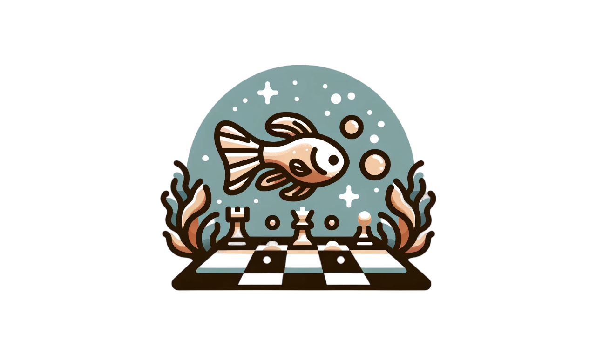

<p align="center">

</p>

# guppy
### A first attempt at programming a chess engine
This repo is a __work in progress__. It is primarily a fun side project that I am using to learn about chess programming. In any case, a chess engine written in Python is unlikely to take on Stockfish or Leela anytime soon. We'll leave that to a future iteration in a faster language ("GOppy", perhaps :smirk:).

#### Board Representation
The board and pieces are represented as a set of 12 64-bit integers. While representing the board as a two-dimensional array is intuitive and works perfectly well for programming a chess game, an engine's search process is computationally too intensive for that. Luckily, the binary representation of a 64-bit integer maps conveniently to the 64 squares on a chess board, allowing the entire board to be represented by 12 integers (one for each piece type and color). Movement can then be represented by shifting bits in the binary representation of the integer representing any given piece.

```
8 ♖ ♘ ♗ ♕ ♔ ♗ ♘ ♖                   8 ♖ ♘ ♗ ♕ ♔ ♗ ♘ ♖
7 ♙ ♙ ♙ ♙ ♙ ♙ ♙ ♙                   7 ♙ ♙ ♙ ♙ ♙ ♙ ♙ ♙
6 . . . ♟︎ ♙ . . .                   6 . . . ♟︎ ♙ . . .
5 . . . . ♟︎ . . .                   5 . . . . ♟︎ . . .
4 ♙ ♟︎ ♙ ♟︎ . . ♟︎ ♙                   4 ♙ ♟︎ ♙ ♟︎ . . ♟︎ ♙
3 ♟︎ . . ♟︎ . . . ♟︎                   3 ♟︎ . . ♟︎ . . . ♟︎
2 . . . . . . . .                   2 . . . . . . . .
1 ♜ ♞ ♝ ♛ ♚ ♝ ♞ ♜                   1 ♜ ♞ ♝ ♛ ♚ ♝ ♞ ♜
  a b c d e f g h                     a b c d e f g h
```

